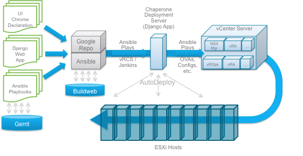
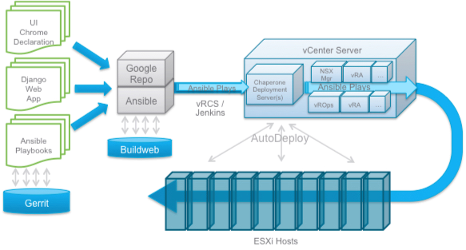

Chaperone Deployment Environment
=====================
Development and deployment require two VMs running [Ubuntu Linux 64-bit](http://www.ubuntu.com/download/server):

- **Development Environment (DE)** is the environment into which you download, modify and commit code..
- **Chaperone Deployment Server (CDS)** is the target into which the development environment deploys the code.

The Chaperone Deployment server runs the applications used to configure a
SDDC Server environment, so must have access to the environment against which
it will act. This file describes deployment options for the Chaperone
Deployment Server (CDS)

##External Deployment
Where firewalls or other security measures would not block access to vCenter
Server and the general SDDC infrastructure by Chaperone, the Deployment Server
can exist anywhere on any network that can reach the SDDC infrastructure.
Examples would be deployment on developer desktops using VMware Fusion or
Workstation. This option would look like the following:

This configuration requires that the vCenter server management port is exposed
on an external ip that is accessible by the CDS server.

##Internal Deployment
In some cases, such as in cloud 'pods' or on production premises, the
Chaperone Deployment Server needs to exist within the context of the
infrastructure management server (e.g., vCenter server). In such cases, the
CDS can be a VM deployed into an on-premises management instance. That
scenario would look similar to the following

In this case, the CDS ssh port (22) would need to be exposed externally if new
builds of the Chaperone GUI(s) were required.
